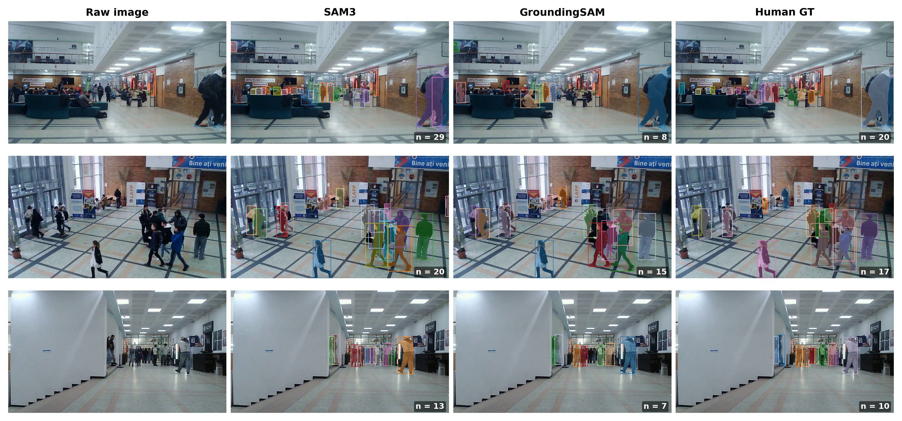
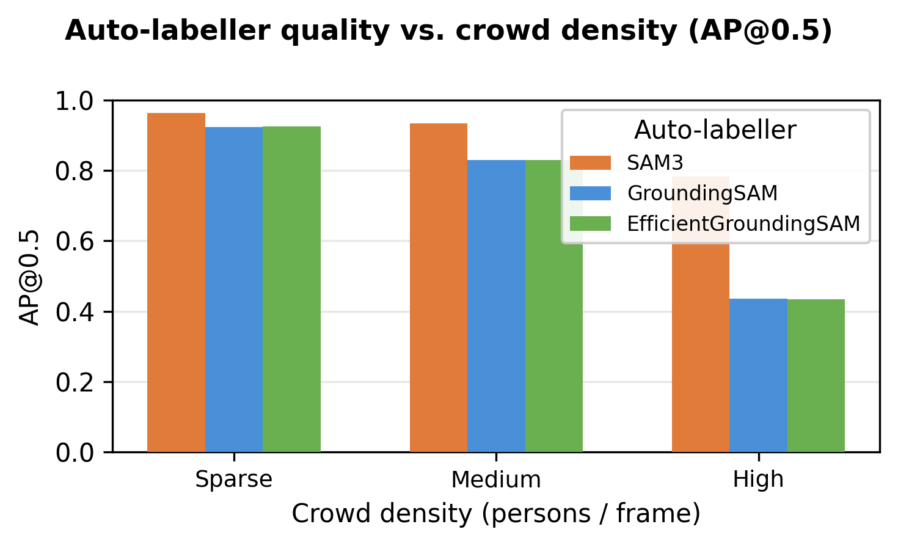
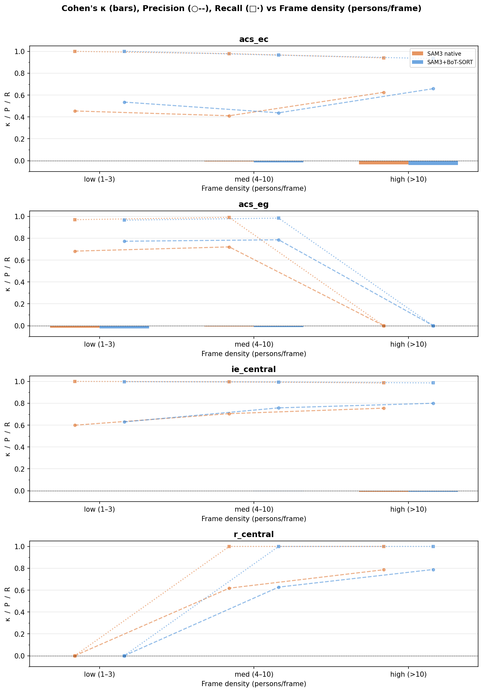
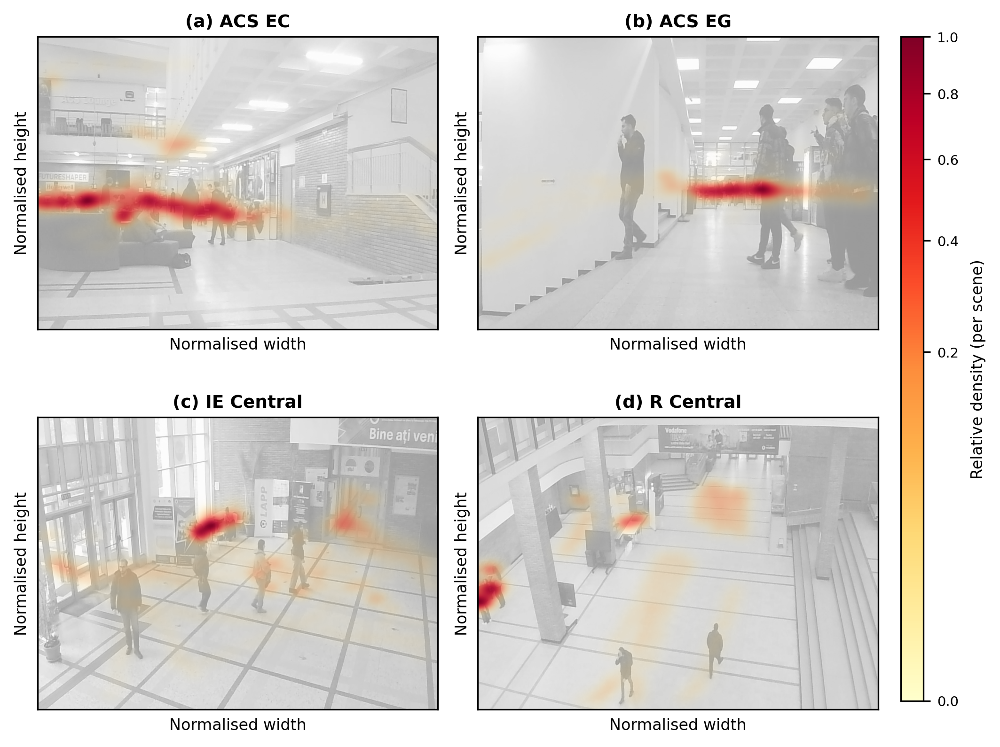

# IndoorCrowd: A Multi-Scene Dataset for Human Detection, Segmentation, and Tracking with an Automated Annotation Pipeline

A machine learning pipeline for automatically annotating people in video data using multiple state-of-the-art segmentation models. The project extracts frames, auto-labels them with several models, compares results against human annotations, and supports training a YOLO-based person detector.

---

## Pipeline Overview

```
Raw Video
    ↓
Frame Extraction (sample_frames.py)
    ↓
Auto-labeling (SAM3 / GroundedSAM / GroundedEdgeSAM)
    ↓
Comparison & Review (compare_sam3_vs_groundedsam.py / review_annotations.py)
    ↓
Golden Dataset Selection (build_golden_mid_frames.py)
    ↓
YOLO Training (train/yolo26.py)
```

---

## Analysis & Results

Evaluations use a common image set and, where noted, human-annotated ground truth on the golden-frame subset.

### Qualitative comparison

Side-by-side view of raw frames with SAM3, GroundingSAM, and human GT masks (challenging crowded frames):



### Annotation statistics (auto-labellers on common images)

| Metric | SAM3 | GroundingSAM | Efficient GroundingSAM |
|--------|------|--------------|-------------------------|
| Images (common) | 50 | 50 | 50 |
| Detection rate | 100% | 100% | 100% |
| Total annotations | 538 | 401 | 401 |
| Anns/image (mean ± std) | 10.76 ± 3.81 | 8.02 ± 3.65 | 8.02 ± 3.65 |
| Anns/image (median) | 9 | 7 | 7 |
| Area fraction, mean (%) | 0.44 | 0.53 | 0.53 |
| Small / Medium / Large | 37 / 482 / 19 | 1 / 371 / 29 | 1 / 371 / 29 |

### Pairwise agreement between auto-labellers

Precision and recall are over matched annotation pairs (greedy bbox-IoU matching). IoU values are means over matched pairs.

| Pair | Matched | Prec. | Rec. | F1 | BBox IoU | Mask IoU |
|------|---------|-------|------|-----|----------|----------|
| SAM3 vs GroundingSAM | 394 | 0.732 | 0.983 | 0.839 | 0.893 | 0.851 |
| SAM3 vs Efficient GroundingSAM | 394 | 0.732 | 0.983 | 0.839 | 0.893 | 0.781 |
| GroundingSAM vs Efficient GroundingSAM | 401 | 1.000 | 1.000 | 1.000 | 1.000 | 0.810 |

### Human vs auto-labels (golden frames, by scene)

Metrics vs human annotations (AP@0.5, Cohen’s κ) on the golden-frame set, by scene group:

| Scene | SAM3 AP@0.5 | SAM3 κ | GroundingSAM AP@0.5 | GroundingSAM κ | Efficient AP@0.5 | Efficient κ |
|-------|-------------|--------|---------------------|-----------------|------------------|-------------|
| acs_ec | 0.783 | 0.849 | 0.435 | 0.762 | 0.433 | 0.758 |
| acs_eg | 0.963 | 0.926 | 0.922 | 0.931 | 0.924 | 0.934 |
| ie_central | 0.928 | 0.923 | 0.803 | 0.902 | 0.804 | 0.904 |
| r_central | 0.946 | 0.864 | 0.901 | 0.859 | 0.900 | 0.849 |

SAM3 tends to over-segment (higher recall, lower precision) in dense scenes; GroundingSAM and Efficient GroundingSAM are more conservative and align closely with each other.

### Paper figures (annotation quality report)

Generated by `analysis/annotation_quality_report.py`:

| Figure | Description |
|--------|-------------|
| [fig1_annotation_counts](analysis/paper_figures/fig1_annotation_counts.png) | Total and mean annotations per model |
| [fig2_count_distribution](analysis/paper_figures/fig2_count_distribution.png) | Violin + box plot of annotations per image |
| [fig3_area_distribution](analysis/paper_figures/fig3_area_distribution.png) | Annotation area fraction histograms |
| [fig4_size_class](analysis/paper_figures/fig4_size_class.png) | COCO size class (small/medium/large) stacked bars |
| [fig5_pairwise_iou](analysis/paper_figures/fig5_pairwise_iou.png) | Bbox and mask IoU box plots per model pair |
| [fig6_count_scatter](analysis/paper_figures/fig6_count_scatter.png) | Per-image count scatter between models |
| [fig7_detection_rate](analysis/paper_figures/fig7_detection_rate.png) | Detection rate per model |

### Quality vs crowd density

AP@0.5 and Cohen’s κ by density bin (from human scene stats), one colour per method:





### Scene-level statistics (human annotations)

Crowd density heatmaps from human labels on the golden set:



---

## Project Structure

```
.
├── labelling/
│   ├── sample_frames.py                      # Extract frames from video at fixed FPS
│   ├── autolabel_sam3.py                     # Auto-label with SAM3
│   ├── autolabel_grounding_sam_3fps.py       # Auto-label with GroundedSAM
│   ├── autolabel_grounded_edgesam_3fps.py    # Auto-label with GroundedEdgeSAM
│   ├── build_golden_mid_frames.py            # Select best frames for golden dataset
│   ├── review_annotations.py                 # Gradio UI to review/edit annotations
│   └── segment_with_fastsam.py               # Gradio UI for interactive segmentation
├── analysis/
│   ├── sample_rate.py                        # Estimate frame counts at different FPS
│   ├── compare_sam3_vs_groundedsam.py         # Compare annotation quality across models
│   ├── annotation_quality_report.py          # Paper-style figures and tables
│   ├── human_vs_models_golden_mid.py         # Evaluate auto-labels vs human GT
│   ├── qualitative_comparison.py             # Qualitative comparison grid
│   ├── auto_labeller_density_bar.py          # AP/κ vs crowd density
│   ├── figures/                              # Qualitative and density figures
│   ├── paper_figures/                        # Report figures and report.json
│   └── reports/                              # JSON reports (comparison, human vs models)
├── train/
│   └── yolo26.py                             # YOLO training script
├── dataset/                                  # Frames, labels, and golden datasets
├── FastSAM-s.pt                              # FastSAM small model weights
├── FastSAM-x.pt                              # FastSAM extra-large model weights
└── pyproject.toml
```

---

## Installation

This project uses [uv](https://github.com/astral-sh/uv) for dependency management.

```bash
uv sync
```

A HuggingFace token is required for downloading SAM3. Create a `.env` file:

```
HF_TOKEN=your_token_here
```

PyTorch is sourced from CUDA 12.8 wheels. Adjust `pyproject.toml` if using a different CUDA version.

---

## Usage

### 1. Extract Frames

```bash
python labelling/sample_frames.py --fps 3 \
    --input dataset/raw_video \
    --output dataset/raw_frames_3fps
```

### 2. Auto-Label

**SAM3** (text-prompted):

```bash
python labelling/autolabel_sam3.py \
    --raw-frames-dir dataset/raw_frames_3fps \
    --output-dir dataset/labels_3fps \
    --text-prompt "person"
```

**GroundedSAM** (language-grounded):

```bash
python labelling/autolabel_grounding_sam_3fps.py \
    --raw-frames-dir dataset/raw_frames_3fps \
    --output-dir dataset/labels_grounding_sam_3fps
```

**GroundedEdgeSAM** (efficient variant):

```bash
python labelling/autolabel_grounded_edgesam_3fps.py \
    --raw-frames-dir dataset/raw_frames_3fps \
    --output-dir dataset/labels_efficient_grounded_sam_3fps
```

All auto-labelers output COCO-format JSON and support `--segmentation-format rle` or `polygon`.

### 3. Compare Model Outputs

```bash
python analysis/compare_sam3_vs_groundedsam.py
```

Generates reports in `analysis/reports/` with per-scene metrics (annotation counts, bbox IoU, mask IoU).

**Full annotation quality report** (figures + LaTeX tables + JSON):

```bash
python analysis/annotation_quality_report.py
```

**Human vs auto-labels** (golden frames, AP & Cohen’s κ):

```bash
python analysis/human_vs_models_golden_mid.py
```

**Qualitative comparison grid** and **AP/κ vs density**:

```bash
python analysis/qualitative_comparison.py
python analysis/auto_labeller_density_bar.py
```

### 4. Review & Correct Annotations

Interactive Gradio UI for reviewing and editing annotations:

```bash
python labelling/review_annotations.py --annotation-source sam3_3fps
```

Available sources: `sam3_3fps`, `grounded_sam_3fps`, `efficient_grounded_sam_3fps`.

For manual segmentation from scratch:

```bash
python labelling/segment_with_fastsam.py \
    --images-dir dataset/raw_frames_3fps \
    --output-json dataset/my_labels.json
```

### 5. Build Golden Dataset

Select up to N frames, prioritizing scene centers:

```bash
python labelling/build_golden_mid_frames.py \
    --input dataset/raw_frames_3fps \
    --output dataset/golden_frames_3fps_mid \
    --max-frames 600
```

Use `--dry-run` to preview selection without copying files.

### 6. Train YOLO

```bash
python train/yolo26.py \
    --dataset dataset/labels_3fps_golden_mid \
    --epochs 100 \
    --batch-size 16
```

---

## Models

| Model | Size | Purpose |
|-------|------|---------|
| SAM3 | Downloaded via HuggingFace | Text-prompted segmentation |
| GroundedSAM | Bundled via autodistill | Language-grounded detection |
| GroundedEdgeSAM | Bundled via autodistill | Efficient language-grounded detection |
| FastSAM-s | 24 MB (included) | Interactive segmentation (fast) |
| FastSAM-x | 145 MB (included) | Interactive segmentation (accurate) |

---

## Dataset Format

All annotations use the [COCO format](https://cocodataset.org/#format-data) with one JSON file per scene. Masks are stored as either RLE or polygon segmentations.

```
dataset/
├── raw_frames_3fps/          # Extracted frames organized by scene
├── labels_3fps/              # SAM3 annotations
├── labels_grounding_sam_3fps/
├── labels_efficient_grounded_sam_3fps/
├── golden_frames_3fps_mid/   # Selected golden frames
├── labels_3fps_golden_mid/
├── labels_grounding_sam_3fps_golden_mid/
└── labels_efficient_grounded_sam_3fps_golden_mid/
```
